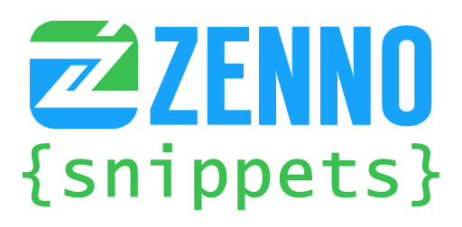

# Сниппеты для ZennoPoster

 Набор пользовательских сниппетов (фрагментов исходного кода) для программы ZennoPoster/CodeCreator. Собираются и поддерживаются в актуальном состоянии благодаря энтузиастам с форума. Каждый желающий может присоединиться к нам и добавить свой сниппет (сделать Pull Request), главное оформить его согласно нижеописанным правилам.

## Правила оформления сниппетов

1. Файлы должны располагаться в директориях, именуемых
[согласно тематике сниппета](https://github.com/ZennoHelpers/Snippets/wiki/Список-директорий) за исключением одиночных файлов;

2. В названии директорий необходимо присутствие квадратных скобок `[]` (без них в CodeCreator'е 5 можно спутать с файлом);

3. Файлы должны иметь расширение, в соответствии с содержащимся в них языком (`.cs`, `.fs`, `.js`);

4. Все сниппеты должны иметь кодировку UTF-8 без BOM;

5. Необходимо использовать в файле либо табуляцию (по-старому), либо пробелы (`.cs` - 4 пробела, `.js` - 2 пробела), но не одновременно;

6. В начале сниппета желательно присутствие подробного описания в комментарии;

7. Код должен быть валидным и не должен вызывать ошибки компиляции;

8. Если необходимо добавить класс/стороннюю библиотеку через GAC, то это необходимо описать в виде комментария.

## Порядок добавления своих сниппетов

### Полная инструкция

1. [Регистрация на GitHub](https://git-scm.com/book/ru/v2/GitHub-%D0%9D%D0%B0%D1%81%D1%82%D1%80%D0%BE%D0%B9%D0%BA%D0%B0-%D0%B8-%D0%BA%D0%BE%D0%BD%D1%84%D0%B8%D0%B3%D1%83%D1%80%D0%B0%D1%86%D0%B8%D1%8F-%D1%83%D1%87%D0%B5%D1%82%D0%BD%D0%BE%D0%B9-%D0%B7%D0%B0%D0%BF%D0%B8%D1%81%D0%B8)

2. [Как сделать Fork и отправить Pull Request](https://git-scm.com/book/ru/v2/GitHub-%D0%92%D0%BD%D0%B5%D1%81%D0%B5%D0%BD%D0%B8%D0%B5-%D1%81%D0%BE%D0%B1%D1%81%D1%82%D0%B2%D0%B5%D0%BD%D0%BD%D0%BE%D0%B3%D0%BE-%D0%B2%D0%BA%D0%BB%D0%B0%D0%B4%D0%B0-%D0%B2-%D0%BF%D1%80%D0%BE%D0%B5%D0%BA%D1%82%D1%8B)

### Краткая инструкция

1. Зарегистрироваться на GitHub

2. Сделать Fork этого репозитория к себе в аккаунт, перейти в него

3. Добавить новые сниппеты через кнопку "Create new file", предварительно приведя их к требованиям, описанным выше

4. Сделать commit изменений в ветку master (или создать отдельную, где будут все добавляемые сниппеты)

5. Отправить Pull Request и дождаться Code Review (проверка на ошибки и соответствие требованиям к оформлению). Пожалуйста, отнеситесь к этой процедуре с пониманием — она направлена только на повышение качества проекта

6. Исправить найденные недочёты и сделать commit с этими изменениями

7. После повторной проверки кода один из администраторов добавит ваши сниппеты в репозиторий (сделает merge)

### Альтернативные инструкции:

- https://github.com/urfu-2015/guides/blob/master/how-to-pull-request.md

- https://jeka.by/post/1053/github-send-PR-to-other-repository/

- https://rustycrate.ru/руководства/2016/03/07/contributing.html

- https://progtask.ru/kak-sdelat-pull-request-na-github/

_Если у вас возникли сложности или есть вопросы, то вы всегда можете обратиться к кому-то из администраторов проекта напрямую или [написать issue](https://github.com/ZennoHelpers/Snippets/issues/new)._
